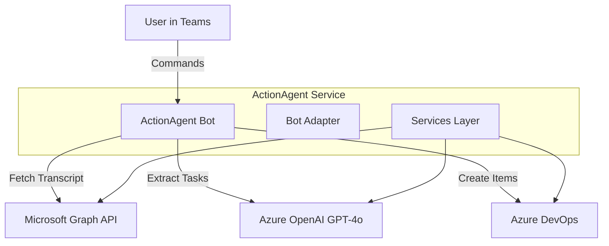

#  ActionAgent

> **AI-powered Teams bot that transforms meeting conversations into Azure DevOps work items**

[](https://github.com/JackAmichai/ActionAgent/actions)
[](https://opensource.org/licenses/MIT)

---

## 💡 The Problem

Engineers agree to tasks during meetings but forget to log them:

> *"Sarah, can you fix that login bug?"*  
> *"Mike, update the API docs by Friday"*  
> *"We need unit tests for the payment module"*

These commitments vanish into thin air. **ActionAgent captures them automatically.**

---

## ✨ The Solution

ActionAgent listens to your Teams meetings and:

1. **📝 Captures** - Fetches the meeting transcript via Microsoft Graph
2. **🧠 Analyzes** - Uses GPT-4o to extract technical tasks, **assignees**, **priority**, and **sentiment**.
3. **📋 Creates** - Automatically generates work items (Tasks, Bugs, User Stories) in Azure DevOps.
4. **💬 Reports** - Posts a summary card back to the Teams chat with links and status.

**Result**: Zero tasks slip through the cracks.

---

## 🏗️ Architecture



---

## 🚀 Deployment Options

### Option 1: Vercel (Serverless)

ActionAgent is optimized for Vercel Serverless Functions.

1.  **Fork** this repository.
2.  **Import** into Vercel.
3.  **Configure Environment Variables** (see below).
4.  **Deploy**. Vercel will automatically detect the configuration.

### Option 2: Docker

```bash
# Build the container
docker build -t action-agent .

# Run the container
docker run -p 3978:3978 --env-file .env action-agent
```

### Option 3: Azure App Service

Standard Node.js deployment to Azure App Service is fully supported.

---

## 📋 Prerequisites

| Component | Demo Mode | Full Mode | How to Get |
|-----------|:---------:|:---------:|------------|
| Node.js 18+ | ✅ | ✅ | [nodejs.org](https://nodejs.org) |
| Azure OpenAI | ✅ | ✅ | [Azure Portal](https://portal.azure.com) |
| Azure DevOps | ✅ | ✅ | [dev.azure.com](https://dev.azure.com) |
| Microsoft 365 | ❌ | ✅ | [Business Basic Trial](https://www.microsoft.com/microsoft-365/business/microsoft-365-business-basic) |
| Azure AD App | ❌ | ✅ | Azure Portal |

---

## 🔧 Environment Variables

Create a `.env` file:

```bash
# Demo Mode - bypass M365 requirements
DEMO_MODE=true

# Azure OpenAI (REQUIRED)
AZURE_OPENAI_ENDPOINT=https://your-resource.openai.azure.com/
AZURE_OPENAI_KEY=your-key
AZURE_OPENAI_DEPLOYMENT=gpt-4o

# Azure DevOps (REQUIRED)
AZURE_DEVOPS_ORG_URL=https://dev.azure.com/your-org
AZURE_DEVOPS_PAT=your-personal-access-token
AZURE_DEVOPS_PROJECT=Engineering

# Azure AD (Required for Full Mode only)
AZURE_TENANT_ID=your-tenant-id
AZURE_CLIENT_ID=your-client-id
AZURE_CLIENT_SECRET=your-secret

# Bot Framework (Required for Full Mode only)
BOT_ID=your-client-id
BOT_PASSWORD=your-secret
```

---

## 🎯 Commands

### Demo Mode
```bash
npm run demo    # Interactive demo with mock transcript
```

### Full Mode (requires M365)
```bash
npm start       # Start the Teams bot
npm run dev     # Development mode with ts-node
```

### Development
```bash
npm test              # Run tests
npm run test:coverage # Run tests with coverage
npm run build         # Compile TypeScript
npm run lint          # Lint code
npm run format        # Format code
```

---

## 📁 Project Structure

```
src/
├── index.ts              # Entry point (Standalone Server)
├── adapter.ts            # Shared Bot Adapter logic
├── config.ts             # Centralized configuration
├── teamsBot.ts           # Bot command handling
├── demo.ts               # Interactive demo script
├── services/
│   ├── graphService.ts   # Microsoft Graph API
│   ├── aiService.ts      # Azure OpenAI integration (Zod validated)
│   ├── devopsService.ts  # Azure DevOps API
│   └── identityService.ts# User identity resolution
├── utils/
│   ├── errorHandling.ts  # Retry logic, error types
│   └── telemetry.ts      # Structured logging and metrics
├── models/
│   └── actionItem.ts     # Type definitions
└── cards/
    └── summaryCard.ts    # Adaptive Card templates

api/
└── messages.ts           # Vercel Serverless Entry Point
```

---

## 🧪 Testing

```bash
# Run all tests
npm test
```

**77+ tests** covering:
- Error handling & retry logic
- Telemetry service
- Adaptive Card generation

---

## 🔒 Security

- All secrets via environment variables
- Client Credentials flow for Graph API
- PAT for Azure DevOps (recommend Service Principal for production)
- No PII logged
- Correlation IDs for tracing
- See `SECURITY.md` for more details.

---

## 📜 License

MIT © Jack Amichai

---

## 🙏 Acknowledgments

Built with the **"One Microsoft"** stack:
- Microsoft Teams + Bot Framework
- Microsoft Graph API
- Azure OpenAI (GPT-4o)
- Azure DevOps

*Turn meetings into momentum.*
